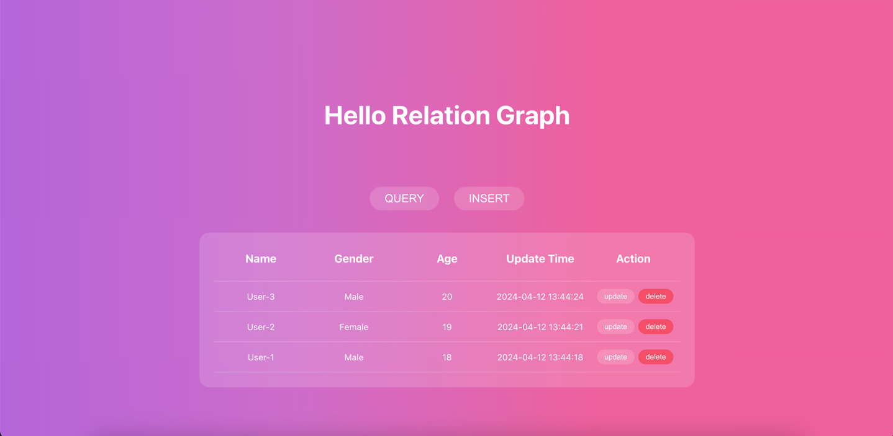

# Introduction

the relation graph demo

---
 
## run

1. start the relation-graph

2. grant permission

```shell
dfx canister call relation_graph acl_grant '("2vxsx-fae","user")'
```

3. update config

```javascript
// /src/HelloGraph/utils/constant.ts
// change to your relation graph canisterId
export const LOCAL_GRAPH_CANISTER_ID = 'rrkah-fqaaa-aaaaa-aaaaq-cai'
// change to your ic host
export const LOCAL_HOST = 'http://localhost:8000'
```

4. run

```bash
npm install

npm run build

npm run start
```



